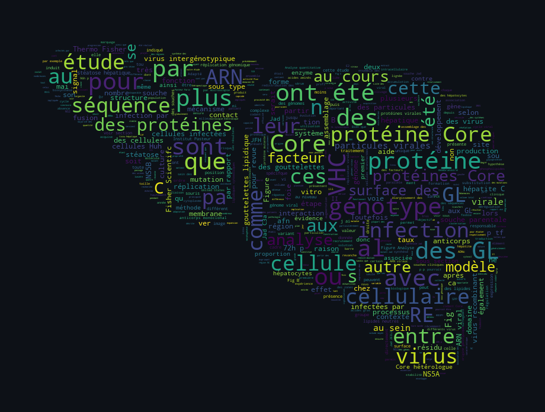

# 🎓 PhD Thesis — LaTeX Source Code

**Welcome!**

This repository contains the complete LaTeX source code and manuscript structure for my PhD thesis in Medical Virology.

I’m sharing this project to help other PhD students and researchers build their own manuscripts more easily. You are welcome to reuse, adapt, and learn from this structure for your own LaTeX-based thesis or scientific publications !

<p align="center">  </p>

## 📂 What's in this Repository?

This repository is organized in modular chapters with `main.tex` compiling everything together.

```
manuscript/
├── chapter-01_introduction/
│   ├── figs/
│   ├── 01_introduction.tex
├── chapter-02_project/
│   ├── figs/
│   ├── 02_objectives.tex
│   ├── 02_project.tex
├── chapter-03_discussion/
│   ├── figs/
│   ├── 03_discussion.tex
├── chapter-04_material/
│   ├── figs/
│   ├── 04_material.tex
├── chapter-05_methods/
│   ├── figs/
│   ├── 05_methods.tex
├── ressources/
├── bibliography.bib        # Contains all my sources and scientific references (Zotero-generated BibTeX).
└── contributions.tex       # List of the precious contributors of my PhD work (Tex code)
└── coverpage.tex           # Cover page layout (Tex code)
└── titlepage.tex           # Title page layout (Tex code)
└── custom_commands.tex     # Custom LaTeX commands
└── packages.tex            # Required packages
└── main.tex                # Main compilation file
```

## 🚀 Quickstart

### 1️⃣ Clone or Download the Repository

```
bash

git clone https://github.com/emeline-simon/thesis.git
cd thesis/manuscript
```

Or download the ZIP → extract → open the manuscript/ folder.

---
### 2️⃣ Open the project in your LaTeX Editor

To compile the manuscript, you will simply need:

→ **A LaTeX distribution** : MiKTeX (Windows) or TeX Live (Linux / macOS)<br>
→ **A LaTeX-compatible editor** or **IDE** (I am using Visual Studio Code with LaTeX extensions)

> [!NOTE]
> *Any LaTeX workflow should work as long as BibTeX is available.*

---
### 3️⃣ Compile the manuscript

Compile in this order (important for references and bibliography):

```
pdflatex main.tex
bibtex main
pdflatex main.tex
pdflatex main.tex
```

Some IDE automate this full sequence.<br>
The final `main.PDF` will be generated inside the manuscript folder.
